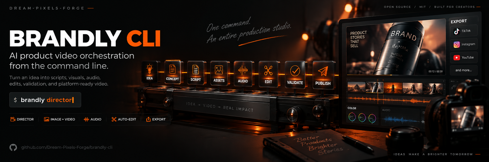

# Brandly CLI

<p align="center">
  
</p>

> **AI product video orchestrator** — add image, video, and sound generation capability to any AI tool (OpenCode, Codex, Qwen Code, Claude Code, etc.) via a CLI and Director agent.

[](https://pypi.org/project/brandly-cli/)
[](https://www.python.org/downloads/)
[](LICENSE)
[](https://github.com/Dream-Pixels-Forge/brandly-cli)
[](https://github.com/Dream-Pixels-Forge/brandly-cli)
[](https://github.com/Dream-Pixels-Forge/brandly-cli/actions)
[](https://github.com/Dream-Pixels-Forge/brandly-cli/stargazers)

---

## What is Brandly?

Brandly is an **autonomous video production pipeline** that turns product ideas into platform-ready marketing videos. It provides:

- **Image generation** via [Agnes AI](https://apihub.agnes-ai.com) (text-to-image, image-to-image)
- **Video generation** via Agnes AI (text-to-video, keyframe-controlled, reference-based)
- **Audio generation** via [MiniMax Audio](https://platform.minimaxi.com) (background music, TTS voiceover)
- **3D Spatial Control** — Blender PlayBlast renderer for spatial reference frames (camera composition, depth, keyframes) feeding Agnes AI keyframe/reference modes
- **Multi-agent pipeline** — automated workflow from idea → trends → concept → script → assets → audio → validate → publish
- **Director orchestrator** — an autonomous agent that guides the entire production process
- **Credit budgeting** — track spend per phase against a project budget
- **Style presets** — avoid AI slop with photorealistic, cinematic, editorial, commercial, and documentary presets
- **Production plan as source of truth** — every generation registers on `docs/plan/production_plan.md`; `brandly produce` generates multi-shot films one shot at a time (Agnes: 1 request/min)
- **Smaller reference payloads** — large local images auto-convert to webp/jpeg before upload

### v0.3.15 New Features + Issue Fixes (#19–#24)

| Fix | Description |
|-----|-------------|
| **Image converter** | `src/brandly_cli/image_convert.py` — large local references auto-shrink to webp/jpeg (JPEG opaque, WebP alpha; `BRANDLY_IMAGE_CONVERT=off` to disable) — 1.7 MB PNG → 410 KB JPEG |
| **`brandly produce` (shot-by-shot)** | New command: registers ALL shots on the production plan first, then generates one at a time with a 60 s wait (1 req/min). No batch/parallel mode; resumable (COMPLETED shots skipped, failures stay PENDING) |
| **Scoped auto-refs (#20)** | `brandly video --no-auto-refs` / `--auto-ref-category <name>` — stop payload bloat + style bleed in multi-look projects |
| **Style follows `--style` (#21)** | `create_video_task` takes `style_preset`; no more hardcoded cinematic suffix on stylised work (e.g. monochrome sumi-e) |
| **Reference import (#23)** | `brandly reference <id> --image <path> [--no-generate]` — adopt client-supplied plates as `primary_reference`, zero credit spend |
| **Visible create errors (#24)** | Failures print `ExceptionType: detail` (no more empty messages); create timeout 60 s → 180 s |
| **Graceful `brandly jobs` (#19)** | 404 degrades to a dim hint (`brandly job-resume <id>`) instead of error spam |
| **Rate-limited `brandly batch`** | Variants submit one at a time (60 s spacing) + style-preset parity; kept as the future batch path when Agnes supports true batch |

### v0.3.12 Bug Fixes

| Fix | Description |
|-----|-------------|
| **Auto credit spend recording** | `brandly video` / `brandly image` now auto-record credits via `CostTracker`; `brandly status` shows real spend — budget gate fires correctly (#18) |
| **Windows Unicode crash fixed** | `cli()` reconfigures stdout/stderr to UTF-8 on Windows; all async Click commands (`jobs`, `edit`, `resize`, `concat`, `audio`, `captions`, `speed`, `batch`, `minimax_*`, `ark_*`) now actually run (#12) |
| **Stitch stderr + no-audio clips** | ffmpeg errors now surface the *tail* of stderr (not the version banner); multi-clip xfade gracefully falls back to video-only when any input lacks an audio stream (#17) |
| **Export ancestor-dir guard** | `brandly export` aborts with a clear message when `--output` is an ancestor of the project dir instead of silently copying nothing (#16) |
| **Agnes 429/400 fixes** | Create-endpoint 429s now back off ≥60 s (respecting the 1 req/min limit); 400 body is surfaced; stale v2.0 tip removed; timeout message points at `job-resume` (#15) |
| **Pipeline no longer a mock** | Director phases dispatch real work — `asset` calls `generate_video`, `audio` calls `generate_music`, `trends` calls `research_trends`, `validate` runs `quality_gate` (#14) |
| **Phase artifact gating** | `brandly approve` now refuses to advance if required artifacts are missing (e.g. approving `asset` with zero clips) (#13) |
| **Root auto-detection** | `_get_root` walks up from cwd looking for `.brandly` marker, preventing doubled-nested project trees when running from inside a project dir (#13) |

### v0.3.9 New Features

| Feature | Description |
|---------|-------------|
| **Blender 3D Spatial Pipeline** | `skills/brandly-3d-spatial/` — PlayBlast + EEVEE fallback renders spatial references for Agnes keyframe/reference modes; Blender version auto-detection via `blender_integration.py` |
| **Resilient 503 Retry** | Video task creation now uses 5 retries with jitter + `Retry-After` header support; prevents transient GPU backend outages from failing the whole pipeline |
| **Spatial Reference System** | `brandly/layout.py` now creates `3d-spatial/{cameras,keyframes,depthmaps,general}/` per project |

### v0.3.7 New Features

| Feature | Description |
|---------|-------------|
| **Quality Gate** | `brandly gate <id> <element>` — anti-slop/anti-drift verification before the next step |
| **AI Visual Review** | Multimodal model scores quality, slop, distortion, drift, and matte backdrop |
| **Auto-Gate** | `brandly reference` and `brandly video` run the gate post-generation (`--no-gate` to skip) |
| **Matte Sheets** | Reference sheets now use a seamless matte mid-grey studio backdrop for clean cutouts |
| **Gate Reports** | Auditable reports written to `.brandly/<project>/docs/tmp/` |

### v0.3.1 New Features

| Feature | Description |
|---------|-------------|
| **Stitch** | Multi-shot video assembly with transitions (fade, dissolve) and color grading |
| **Export Platforms** | Platform-optimized exports for TikTok, Instagram, YouTube, Facebook |
| **Thumbnails** | Keyframe extraction with text overlays |
| **Dubbing** | Multi-language video dubbing via MiniMax TTS |
| **Beat Sync** | Music-reactive editing with beat detection |
| **Auto-Director** | Script-to-video pipeline automation |
| **Trends** | Trending format research database |
| **Analyzer** | Video performance prediction & scoring |
| **Templates** | Reusable project configurations |
| **Webhook** | CI/CD integration with job queue |
| **Sharing** | Cloud export with pluggable providers |

---

## Installation

```bash
pip install brandly-cli
```

### Install Agent Skills

Brandly ships a set of agent skills (camera language, storyboard, production bible,
character/object/vehicle/animal/plant/mecha sheets, 3D spatial, consistency, video generation)
that you can install into any AI tool that supports the `npx skills` protocol:

```bash
npx skills add https://github.com/Dream-Pixels-Forge/brandly-cli/tree/main/skills
```

Available skills (see [skills/README.md](skills/README.md) for details):

| Skill | Purpose |
|-------|---------|
| `brandly-camera` | Hollywood camera language — framing, angles, placement, composition, movement, Rembrandt/butterfly/split lighting |
| `brandly-video-generation` | Master skill — generate AI video & images with prompt engineering |
| `brandly-storyboard` | Plan shot-by-shot visual blueprints |
| `brandly-production-bible` | Single source-of-truth campaign document |
| `brandly-consistency` | Lock visual identity across all shots |
| `brandly-character-sheet` | Character reference sheets |
| `brandly-object-sheet` | Product/object reference sheets |
| `brandly-location-sheet` | Location/set reference sheets |
| `brandly-vehicle-sheet` | Vehicle reference sheets |
| `brandly-mecha-sheet` | Mecha/robot reference sheets |
| `brandly-animal-sheet` | Animal/creature reference sheets |
| `brandly-plant-sheet` | Plant/botanical reference sheets |
| `brandly-3d-spatial` | Blender PlayBlast renderer — spatial reference frames for Agnes keyframe/reference video modes |

### Configure API Keys

```bash
export AGNES_API_KEY="your-agnes-api-key"
export MINIMAX_API_KEY="your-minimax-api-key"
```

Or create a `.env` file:

```dotenv
AGNES_API_KEY=your_key_here
MINIMAX_API_KEY=your_key_here
AGNES_BASE_URL=https://apihub.agnes-ai.com/v1
MINIMAX_BASE_URL=https://api.minimaxi.com/v1
```

## Quick Start

### 1. Initialize a Project

```bash
brandly init \
  --name "SuperWidget Pro" \
  --idea "A revolutionary widget that organizes your desk with AI" \
  --style cinematic \
  --budget 500 \
  --shots 5 \
  --platforms tiktok instagram youtube
```

### 2. Run the Pipeline

```bash
brandly estimate --style cinematic --shots 5
brandly run <project-id>
brandly approve <project-id> <phase>
brandly director
```

### 3. Generate Media

```bash
brandly image --prompt "product on marble surface" --style-preset cinematic
brandly video <project-id> --prompt "sleek earbuds rotating" --duration 5
brandly music --prompt "upbeat electronic" --duration 30
brandly tts "Welcome to SuperWidget Pro"
```

### 4. 3D Spatial References (Optional)

If Blender is installed, generate spatial reference frames for Agnes AI keyframe/reference modes:

```bash
# Detect installed Blender version
python -c "from brandly_cli.blender_integration import detect_blender; v = detect_blender(); print(v)"

# Render spatial references
python skills/brandly-3d-spatial/scripts/playblast_renderer.py \
  --config .brandly/my-project/3d-spatial/cameras/scene.json \
  --output .brandly/my-project/3d-spatial/cameras \
  --mode single

# Extract references for Agnes
python skills/brandly-3d-spatial/scripts/extract_references.py \
  --input .brandly/my-project/3d-spatial/cameras \
  --output .brandly/my-project/3d-spatial/keyframes \
  --strategy first
```

### 5. Export & Share

```bash
brandly export <project-id> --platforms tiktok youtube
brandly thumbnail <project-id>
brandly stitch clip1.mp4 clip2.mp4 --transition fade
brandly voice-match input.mp4 --source en --target es
brandly analyze video.mp4
brandly share output.mp4
```

## CLI Reference

### Project Management

| Command | Description |
|---------|-------------|
| `brandly init` / `brandly start` | Start a new video project |
| `brandly status <id>` | Show project status |
| `brandly list` | List all projects |
| `brandly run <id>` | Run the next pipeline phase |
| `brandly approve <id> <phase>` | Approve a phase and advance |
| `brandly cost <id>` | Show cost summary |

### Media Generation

| Command | Description |
|---------|-------------|
| `brandly image` | Generate an image via Agnes AI |
| `brandly video <id>` | Generate a video via Agnes AI (with 503 resilience) |
| `brandly music` | Generate background music |
| `brandly tts <text>` | Generate voiceover via TTS |
| `brandly produce <id> --shots shots.json` | Multi-shot film: registers ALL shots on the production plan (source of truth), then generates **one shot at a time** with a 60 s wait (Agnes: 1 request/min). No batch/parallel mode; resumable |

Large local reference images are auto-converted to smaller webp/jpeg payloads
before upload (disable with `BRANDLY_IMAGE_CONVERT=off`). Scope auto-injected
references with `brandly video --no-auto-refs` / `--auto-ref-category <name>`,
and adopt client-supplied plates with
`brandly reference <id> --image <path> [--no-generate]`.

### Post-Production

| Command | Description |
|---------|-------------|
| `brandly stitch <clips...>` | Multi-shot video assembly |
| `brandly export <id> --platforms <p>` | Export for specific platforms |
| `brandly thumbnail <id>` | Generate thumbnails |
| `brandly voice-match <video> --source <lang> --target <lang>` | Dub video |
| `brandly beat-sync <video> <audio>` | Cut video to beats |
| `brandly analyze <video>` | Predict performance metrics |
| `brandly share <file>` | Upload for cloud sharing |

### Intelligence

| Command | Description |
|---------|-------------|
| `brandly trend <category>` | Research trending formats |
| `brandly template list` | List templates |
| `brandly template use <name>` | Create project from template |
| `brandly validate <id>` | Run virality validation |
| `brandly gate <id> [element]` | Verify an element (anti-slop/drift) before the next step |
| `brandly director` | Show Director agent prompt |

### 3D Spatial

| Command | Description |
|---------|-------------|
| (Python API) | `from brandly_cli.blender_integration import detect_blender, is_blender_available` |

---

## Keywords

`ai video generation`, `product video`, `marketing video`, `cli tool`, `agent pipeline`, `multi-agent`, `agentic ai`, `brand video`, `social media video`, `tiktok video`, `youtube video`, `image generation`, `video generation`, `keyframe video`, `reference video`, `blender 3d`, `spatial reference`, `agnes ai`, `minimax tts`, `background music`, `voiceover`, `director agent`, `pipeline orchestration`, `creative ai`, `automated video production`, `product demo`, `commercial`, `advertising`, `content creation`, `shot list`, `storyboard`, `consistency`, `character sheet`, `reference sheet`

---

## License

MIT — Dream Pixels Forge
