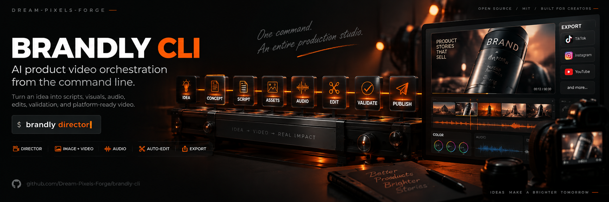
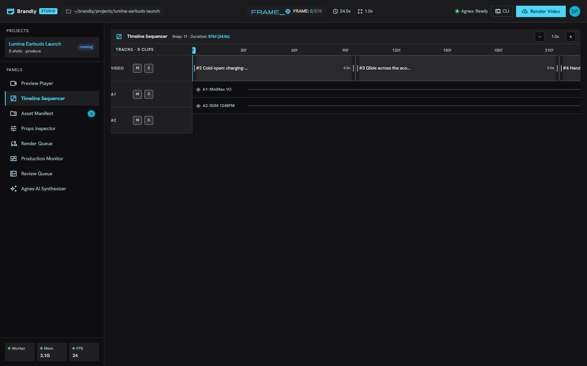

# Brandly CLI

  

> **AI product video orchestrator** — create professional product videos with AI. Works with any AI tool (OpenCode, Codex, Qwen Code, Claude Code, etc.) via CLI, agent tools, and MCP server.

---

## 🎬 What is Brandly?

**Brandly helps you create professional product videos using AI** — from concept to final render, all from the command line or your favorite AI assistant.

### ✨ What You Can Do

| Capability | Description |
|------------|-------------|
| **Generate images** | Text-to-image, image-to-image with Agnes AI |
| **Generate videos** | Text-to-video, keyframe-controlled, reference-based (consistent characters/objects) |
| **Generate audio** | Background music, voiceovers (TTS) via MiniMax |
| **3D spatial reference** | Blender PlayBlast for precise camera/lighting reference frames |
| **Shot-by-shot production** | Plan → generate → assemble with retries, resume, and canonical naming |
| **Post-production** | Stitch, color-grade, captions, dubbing, beat-sync, thumbnails |
| **Quality gates** | Anti-slop/drift verification before each step |
| **Multi-platform export** | TikTok, Instagram Reels, YouTube Shorts, generic MP4 |
| **Schedule & publish** | Direct to TikTok/IG/YouTube (dry-run first, credential-gated) |

### 🎯 Who Is This For?

- **Marketers & creators** — make product videos without a production team
- **Developers** — integrate video generation into your apps/agents via CLI or MCP
- **AI enthusiasts** — orchestrate multi-modal AI workflows (image + video + audio)

---

## 🚀 Quick Start (5 minutes)

### 1. Install

`ash
pip install brandly-cli
`

### 2. Get an API Key

1. Sign up at [Agnes AI](https://apihub.agnes-ai.com)
2. Get your API key
3. Set it as environment variable:

`ash
export AGNES_API_KEY="your_key_here"
# Add to your ~/.bashrc or ~/.zshrc for persistence
`

### 3. Create Your First Video Project

`ash
# Interactive project setup
brandly init -n "My Product" -i "A sleek wireless charger that doubles as a desk lamp"

# Or one-liner:
brandly init -n "Wireless Charger" -i "Minimalist 2-in-1 charger and lamp, premium materials" -s cinematic -b 200
`

### 4. Generate Shots (Director Mode)

`ash
# Let the Director agent plan and execute
brandly run <project_id> --execute --until produce

# Or step-by-step:
brandly run <project_id> --execute --until script    # Write shot list
brandly run <project_id> --execute --until asset     # Generate shots
brandly run <project_id> --execute --until validate  # Quality check
brandly run <project_id> --execute --until publish   # Export & schedule
`

### 5. View Results

`ash
# Open visual timeline editor
brandly timeline <project_id>

# Or check status
brandly status <project_id>
`

---

## 📋 Core Workflows

### For Creators (Human-Driven)

`ash
# 1. Create project
brandly init -n "Product Name" -i "Brief description" -s cinematic

# 2. Review & approve the shot plan
brandly status <id>
brandly approve <id> script

# 3. Generate assets (one shot at a time, resumable)
brandly run <id> --execute --until asset

# 4. Quality check
brandly gate <id> --all-scenes

# 5. Assemble & export
brandly run <id> --execute --until publish
`

### For AI Agents (Tool-Driven)

Driving brandly from an AI tool — connect through the MCP server or call the tool surface directly:

Brandly exposes **15 agent-callable tools** via MCP server:

`ash
# Start MCP server (for Cursor, Claude Code, etc.)
brandly mcp serve

# Or use tools directly:
brandly tools --json           # List all available tools
brandly tools call produce_shots --project_id <id> --shots 5
brandly tools call gate_scene --project_id <id> --scene_id S01
`

**Available tools:** init_project, produce_shots, gate_scene, stitch_video, export_platforms, publish_video, estimate_cost, check_quota, 
egister_reference, 
ecover_job, and more.

---

## 🎨 Common Commands Cheat Sheet

### Project Setup
`ash
brandly init -n "Name" -i "Idea" -s cinematic -b 500    # New project
brandly status <id>                                      # Full project overview
brandly approve <id> <phase>                             # Human gate approval
`

### Generation
`ash
brandly run <id> --execute --until produce              # Full auto-pipeline
brandly run <id> --execute --only shot-03 shot-07       # Regenerate specific shots
brandly produce <id> --shots shots.json --interval 60   # Manual shot-by-shot
brandly video <id> -p "prompt" --style commercial       # Single video clip
`

### Quality & Validation
`ash
brandly gate <id> --all-scenes --json                   # All scenes quality check
brandly gate <id> --element ./clip.mp4 --ref ./ref.png  # Single element check
brandly validate <id>                                   # Virality scoring
`

### Post-Production
`ash
brandly stitch clip1.mp4 clip2.mp4 --ratio 2.39:1 --fit crop --output final.mp4
brandly export <id> --platforms tiktok,instagram,youtube
brandly thumbnail <id> --style cinematic
brandly voice-match <video> --source en --target es    # Dubbing
brandly beat-sync <video> <music>                       # Cut to beats
`

### Publishing
`ash
brandly publish <id> --dry-run                          # Preview what will happen
brandly publish <id> --platforms tiktok,instagram       # Schedule posts
brandly config set tiktok <token>                       # Store credentials
`

### Utilities
`ash
brandly estimate --style cinematic --shots 8            # Cost preview
brandly quota                                           # Daily quota remaining
brandly timeline <id>                                   # Open visual editor
brandly director                                        # Show agent prompt
`

---

## 🎬 Video Generation Deep Dive

### Styles Available
| Style | Best For |
|-------|----------|
| cinematic | Storytelling, brand films |
| commercial | Product demos, ads |
| ugc | TikTok/Reels native feel |
| montage | Fast-paced showcase |
| continuous | One-take style |
| unboxing | Product reveals |
| lifestyle | In-context usage |

### Reference Images (Consistency)
`ash
# Use reference images for consistent characters/objects
brandly video <id> -p "hero walks" --reference-images char.png,prop.png

# Or register references first (recommended for multi-shot)
brandly reference <id> --image char.png --subject-type character
brandly reference <id> --image prop.png --subject-type prop
`

### Keyframe Control
`ash
# Start from first frame, end at last frame
brandly video <id> -p "transition" --mode keyframe --first-frame start.png --last-frame end.png
`

---

## 🤖 Director Agent (AI-Orchestrated)

The Director is an **agent prompt** that knows how to drive Brandly end-to-end:

`ash
# Print the prompt for your AI tool
brandly director

# Or run directly (experimental)
brandly run <id> --execute --yes
`

**Director phases:** 	rends → concept → script → sset → udio → 
e_edit → alidate → publish

Each phase has:
- **Defined inputs/outputs** (see randly plan <id> --json)
- **Gate command** for verification
- **Cost estimate** before execution

---

## 📊 Monitoring & Debugging

`ash
# Project status dashboard
brandly status <id>

# Shot list with progress
brandly scenes <id> --json

# Quota & budget
brandly quota
brandly cost <id> --breakdown

# Job recovery (if process crashed)
brandly job-resume <video_id>
brandly job-poll <video_id> --output recovered.mp4

# Visual timeline editor
brandly timeline <id> --port 8765
`

---

## ⚙️ Configuration

`ash
# Set provider credentials (stored securely)
brandly config set tiktok "access_token=..."
brandly config set instagram "access_token=..."
brandly config set youtube "client_id=... client_secret=..."

# View config
brandly config show

# Environment variables
export AGNES_API_KEY="..."          # Required for video/image
export BRANDLY_IMAGE_CONVERT=off    # Disable auto image compression
export BRANDLY_WEB_PORT=8765        # Timeline editor port
`

---

## 🏗️ Architecture (For Developers)

<strong>Click to expand technical architecture</strong>

### Pipeline Phases
`
init → trends → concept → script → asset → audio → re_edit → validate → publish
`

Each phase is **fail-closed**: failure freezes current_phase, exits non-zero.

### Key Modules
| Module | Responsibility |
|--------|----------------|
| gnes_client.py | Agnes AI HTTP client (retry, backoff, 503 handling) |
| shot_runner.py | Resumable shot-by-shot generation (rate-limited) |
| scenes.py | Explicit scene manifest + completeness gate |
| quality_gate.py | Anti-slop/drift verification (deterministic + AI vision) |
| director.py | Orchestrator prompt + Director.run_pipeline |
| stitch.py | FFmpeg-based assembly (transitions, ratio, color) |
| export_platforms.py | Platform-specific renders (9:16, 1:1, 16:9) |
| cost_tracker.py | Per-phase budgeting + daily quota tracking |
| gent_surface.py | 15-tool MCP surface for AI agents |

### Provider Seam (G14)
Video generation uses a **VideoBackend protocol** — Agnes is one implementation. Adding a new backend:
`python
from brandly_cli.video_backend import VideoBackend, VideoBackendCapabilities

class MyBackend(VideoBackend):
    def capabilities(self): return VideoBackendCapabilities(...)
    async def submit(self, ...): ...
    async def poll(self, ...): ...
    async def fetch(self, ...): ...
`

Then pass ideo_backend=MyBackend() in RunnerConfig.

### Data Flow
`
User input → Director → Shot list (shots.json) → Scene manifest (scenes.json)
    → Production plan → Shot runner (1 req/min) → Clips on disk
    → Quality gate → Stitch → Export platforms → Publish
`

All state lives in .brandly/<project>/ — **disk is the only shared state**.

---

## Demos

Producer videos: [F1tr08UeHLs](https://youtu.be/F1tr08UeHLs) · [7lNt1Y8tAzo](https://youtu.be/7lNt1Y8tAzo)

---

## 🗺️ Roadmap

- ✅ Publish/schedule — supported via `brandly publish` (dry-run, multi-platform posts, stored credentials)
- ✅ Quality gates — per-scene and element checks via `brandly gate`
- ✅ Studio shell — visual timeline editor via `brandly timeline`

---

## 🔧 Development

`ash
# Install dev dependencies
pip install -e ".[dev]"

# Run tests
make test          # Full suite (Python + web contracts)
make lint          # ruff + oxlint + mypy + import-linter

# Web UI development
cd web && npm run dev

# Build wheel
pip wheel . -w dist/
`

Pipeline governance: [AUDIT-AGENTIC-PIPELINE.md](dev-notes/AUDIT-AGENTIC-PIPELINE.md) is the single source of truth for open gaps.

---

## ⭐ Star This Repo

If Brandly helps you create better product videos, please consider starring the repository on GitHub — it helps others discover the project and motivates continued development.

---

## 📄 License

MIT — Dream Pixels Forge
