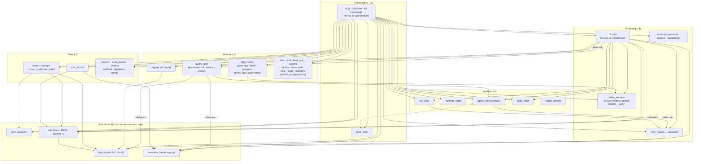
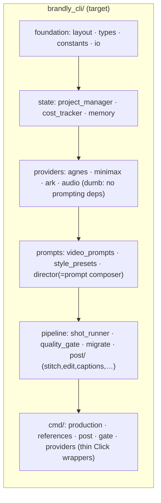

# brandly-cli — Architecture Diagram & Groundedness Assessment

Companion to `ARCHITECTURE.md`. Generated from a static import-graph analysis
of the 39 modules in `src/brandly_cli/` (AST-level, main branch after PRs #44/#45).
Machine-readable graph: `dev-notes/_arch.json`.

## 1. Dependency diagram (layered)

Arrows = module-level imports only; edges marked `···` are **deferred
(function-local) imports** — weaker coupling, no import-time risk.

**Structural invariants observed:**
- Foundation layer (`layout`, `constants`, `types`, `video_prompts`, `stitch`)
  has **zero upward imports** — the hardest layers are leaves. That is the
  single most important property of a well-grounded package.
- Data flows strictly downward: orchestration → pipeline → providers →
  state → foundation. **No module-level import cycles.**
- The only cycle in the graph, `agent_tools ⇄ agnes_client`, is fully
  deferred (function-local imports both ways) — a *logical* coupling, not an
  import-time one. Fine today, watch it.

## 2. Coupling metrics (top of distribution)

| Module | Fan-out | Fan-in | Role |
|---|---|---|---|
| `cli` | **30** | 0 | orchestration hub (expected) |
| `director` | **13** | 1 | second hub (unexpected) |
| `utils` | 1 | **8** | shared helper (healthy) |
| `constants` | 0 | **6** | config registry (healthy) |
| `layout` | 0 | **5** | path source of truth (healthy) |
| `quality_gate` | 3 | 2 | pipeline stage |
| `shot_runner` | 1 | 1 | pure pipeline logic |

Read: fan-in concentrates exactly where it should (foundation/config), and the
only high fan-out nodes are the two orchestration modules.

## 3. Smells found (groundedness gaps)

Ranked by structural risk:

1. **`cli.py` is a 4.8k-line god module (fan-out 30, all 5 layers).**
   It works because every lower layer is clean, but it is where the next
   regressions will live: two produce paths, human gates, cost recording and
   layout selection are all entangled in one file. → *split into `cmd/`
   groups (production, references, post, providers) once PRs #44/#45 land.*
2. **`director.py` is a disguised orchestrator (fan-out 13).** It reaches
   providers, state, memory *and* the pipeline gate. → *either demote it to a
   prompt-composition module (drop provider/state deps) or rename it honestly
   as orchestration.*
3. **Providers import the prompting layer (deferred).** `agnes_client` /
   `ark_client` → `style_presets.apply_style_preset`. Weak (function-local)
   but wrong direction: a provider should be dumb. → *push the style
   application into the caller, or relocate the pure string-transform helpers
   to `constants`/`utils`.*
4. **`agent_tools ⇄ agnes_client` deferred cycle.** → *extract the shared
   job-polling helper so the arrow becomes one-way.*
5. **`utils.py` (fan-in 8) is becoming a kitchen sink** (JSON I/O, plans,
   discovery, filenames, timestamps). → *candidate split: `planning.py`
   (generation/production plans) vs `io.py`.*

## 4. Verdict

**The package is well-grounded at the layer level, with two hub risks at the
top.**

*Grounded (keep as-is):* strict downward dependency flow, leaf foundations,
no module-level cycles, state-management centralised in
`project_manager`/`cost_tracker`, prompt logic isolated in `video_prompts`,
resumability logic isolated in `shot_runner` (pure, no CLI deps — trivially
unit-testable). The issue #31–#43 work actually *improved* the grounding:
new concerns got new leaf modules (`migrate`) or stayed in their layer
(`quality_gate` policy, `shot_runner` retries) instead of leaking into `cli`.

*Needs adjustment (schedule, don't block):* the two items above that cost
real maintenance: (1) `cli.py` → `cmd/` split, (2) `director` demotion.
Items 3–5 are hygiene, one commit each.

**Health score: 8/10.** Structure is sound; the package will not break on
the next feature — but the `cli.py` split is the one refactor that pays for
itself on the feature *after* the split.

## 5. Suggested target shape (after adjustment)

Same layers as today; the changes are mechanical: move `cli.py` sections into
`cmd/*` (thin wrappers that call pipeline functions), strip provider imports
from prompting, and keep `cli.py` as the Click group + shared helpers.
